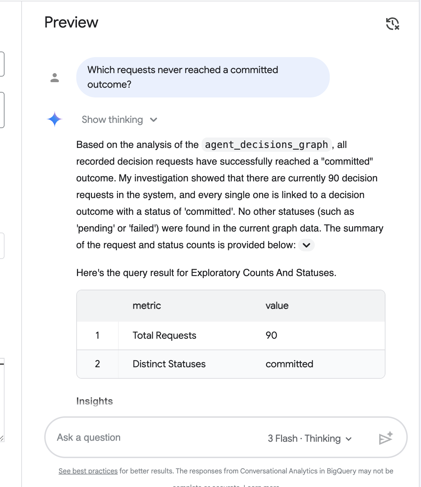

# Ask Your Agent's Decisions in Plain English

*A Conversational Analytics-first guide to the BigQuery agent context graph.*

Your AI agents make decisions all day: which loan to approve, which maintenance
window to schedule, which candidate to pick. The BigQuery Agent Analytics SDK
turns that raw event stream into a queryable **decision graph**: each request,
every option it weighed (with a confidence score), and whether it reached a
committed outcome.

Most teams reach for SQL to query that graph. This guide takes the other path
first: **ask in plain English with Conversational Analytics, and drop to graph
query language (GQL) only when you need the exact lineage.** Same graph, two
front doors.

## Who this is for

The person asking the question is usually *not* the person who wrote the
pipeline: an operations lead spot-checking a flagged session, a PM tracking
decision volume per agent, a risk analyst pulling the low-confidence options an
agent weighed. They think in questions, not joins.

Conversational Analytics (CA) lets them ask the graph directly. The GQL section
at the end is for when an answer needs to become a saved query, a dashboard, or
an audit artifact.

> This is a higher-level companion to the
> [Periodic Materialization codelab](../codelabs/periodic_materialization.md),
> which walks through building the graph step by step. Start there if you want
> the full setup with every command; come back here for the business-reader
> workflow.

## Setup

**Prerequisite — complete the codelab setup first.** This guide assumes you have
already followed the
[Periodic Materialization codelab](../codelabs/periodic_materialization.md)
through materialization, so that your project has: the dataset created, the
graph-table DDL applied, and the `agent_decisions_graph` property graph defined
(`property_graph.sql`). That setup is about ten minutes and is not repeated
here.

With the codelab setup in place, the only two commands specific to this guide
produce a realistic corpus and materialize it:

```bash
export PROJECT_ID="your-project-id"
export DATASET="agent_decisions"   # the dataset from the codelab setup

# 1. Seed ~100 realistic decision sessions (deterministic with --seed).
bqaa seed-events \
    --project-id "$PROJECT_ID" --dataset-id "$DATASET" \
    --scenario decision-realistic --seed 42

# 2. Materialize the decision graph from the events. --lookback-hours 80
#    covers the corpus's 72-hour spread so every completed session is captured.
bqaa context-graph \
    --project-id "$PROJECT_ID" --dataset-id "$DATASET" \
    --property-graph property_graph.sql \
    --lookback-hours 80
```

The seed step reports the exact mix it wrote:

```json
{
  "scenario": "decision-realistic",
  "sessions": 100,
  "session_outcome_counts": {"success": 70, "failed": 10, "orphaned": 10, "truncated": 10}
}
```

The 10 **orphaned** sessions never emitted a terminal event, so they are not
materialized into the graph (an agent that never finished has no committed
outcome). That is intentional, and it is one of the things CA can surface for
you below.

> If a materialization run reports a transient BigQuery streaming-buffer insert
> failure, re-run `bqaa context-graph`. The materializer is idempotent and
> retries the same session window safely.

### Point Conversational Analytics at the graph

In the Google Cloud console, open **Conversational Analytics**, create a data
agent, and connect it to your `$DATASET`. Add the materialized tables
(`decision_request`, `decision_option`, `decision_outcome`) and the raw
`agent_events` table as sources. Give the agent a one-line description of the
domain, for example: *"Each request is an AI agent's decision: the options it
weighed with confidence scores, and whether it reached a committed outcome.
`agent_events` holds the raw run, including which agent ran it and whether it
errored or never finished."*

That context is what lets CA translate "low-confidence options" into the right
filter without anyone writing SQL.

> **What the graph does and doesn't record.** For each request the graph stores
> *every option weighed* (`decision_option`, with confidence) and *that the
> request reached a committed outcome* (`decision_outcome.status`). It does
> **not** record which single option "won" — the codelab ontology does not
> materialize a selected-option link. So the questions below ask about the
> options an agent *considered* and the *session-level* result (completed,
> errored, or abandoned), not about an approved/denied verdict.

## Part 1 — Ask in plain English

Type a plain-English question into the Conversational Analytics chat over your
data agent, and it answers from the graph — generating the SQL for you. Here is
one example end to end.

### Example: "Which requests never reached a committed outcome?"

Asked over the materialized graph, Conversational Analytics reasons about the
decision tables and answers in plain English. The graph holds only committed
decisions — orphaned sessions never become graph nodes — so it reports that
every recorded request reached a committed outcome, and shows the counts and
status breakdown it ran to get there.



To surface the abandoned sessions themselves, ask the same question against the
raw `agent_events` table instead of the graph — that is where the orphaned
sessions live.

### More questions to try

The same data agent answers questions like these, no SQL required:

- *"How many decision sessions did each agent run, and how many errored?"* — per-agent volume and error rate from `agent_events`.
- *"Show me the requests that weighed an option below 0.5 confidence."* — the shaky calls worth a second look.
- *"What did the budget-allocator agent consider, and how confident was it?"* — drill into one agent's options and confidence.
- *"Which decision sessions never reached a committed outcome?"* (asked against `agent_events`) — the abandoned/orphaned sessions.
- *"What's the spread of confidence across the options agents weighed?"* — the distribution of `decision_option.confidence`.

## Part 2 — Inspect the GQL

Plain English is the fast path. When you need the *exact* lineage to live in a
saved query, a scheduled report, or an audit log, drop to the graph directly.

The materializer stitches the decision tables into a BigQuery property graph
(`agent_decisions_graph`). The "what did this request weigh, and did it commit"
question is one `GRAPH_TABLE` traversal:

```sql
SELECT request, considered, score, outcome
FROM GRAPH_TABLE (
  agent_decisions.agent_decisions_graph
  MATCH
    (req:DecisionRequest) -[:evaluatesOption]-> (opt:DecisionOption),
    (req)                 -[:resultedIn]->      (out:DecisionOutcome)
  COLUMNS (
    req.request_id   AS request,
    req.request_text AS question,
    opt.option_label AS considered,
    opt.confidence   AS score,
    out.status       AS outcome
  )
)
ORDER BY request, score DESC;
```

Real output for one request and the options it weighed (from the seeded graph):

```
request     question                          considered  score  outcome
----------  --------------------------------  ----------  -----  ----------
req-069f14  Should we schedule maintenance?   approve      0.91  committed
req-069f14  Should we schedule maintenance?   reject       0.75  committed
req-069f14  Should we schedule maintenance?   escalate     0.75  committed
req-069f14  Should we schedule maintenance?   delegate     0.50  committed
req-069f14  Should we schedule maintenance?   hold         0.48  committed
req-069f14  Should we schedule maintenance?   defer        0.33  committed
```

The agent weighed six options (confidence 0.33 to 0.91) and the request reached a
committed outcome. Note that `outcome` reads `committed` on every row: the graph
records *that* the request committed (one `resultedIn` outcome per request), not
*which* option was chosen — that selection isn't materialized by the codelab
ontology. Because the default extractor uses `AI.GENERATE`, the exact entities
can vary run to run; pass `--extraction-mode=compiled-only` for reproducible
output.

Now the question is portable: schedule it, alert on it, or join it into a
dashboard. CA found the shape; GQL pins it down.

## When to use which

| Use Conversational Analytics when… | Use GQL when… |
|---|---|
| Exploring: "is anything weird in last week's low-confidence calls?" | The answer becomes a saved/scheduled query |
| A business reader needs an answer without SQL | You need exact, reproducible lineage for an audit |
| You're iterating on the question itself | You're wiring the result into a dashboard or alert |
| One-off spot checks | Automation and monitoring |

Start in plain English. Reach for GQL the moment an answer needs to outlive the
conversation.

## Related

- [Periodic Materialization codelab](../codelabs/periodic_materialization.md) — build the graph step by step.
- [`bqaa seed-events`](../../examples/codelab/periodic_materialization/README.md) — the synthetic data generator, including the `decision-realistic` scenario used here.
