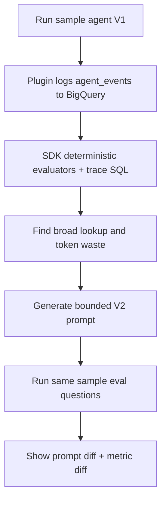
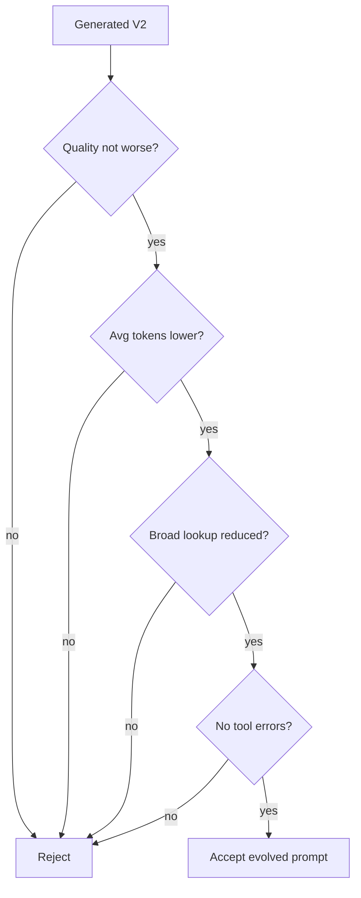
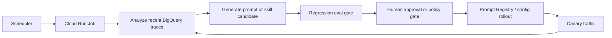

# Self-Evolving Agent Demo

This demo shows a single ADK agent improving from its own logged
behavior. The agent answers basketball analytics questions using deterministic
fixture tools. V1 is intentionally wasteful: it loads broad basketball
reference context and writes long scouting reports even when a narrow
tool can answer the question. The BigQuery Agent Analytics Plugin logs
the sessions to BigQuery, and the SDK reads those traces back to find a
concrete improvement opportunity. The demo generates V2 during the run,
then activates it only when the baseline answers already pass quality
checks and the trace analysis shows broad-tool / token waste.



The point is self-evolution. Token tracking is the measurement signal,
not the product promise.

This is a lightweight companion to `examples/agent_improvement_cycle/`.
That demo shows a production-facing quality-improvement loop with
Prompt Registry and Prompt Optimizer. This demo is intentionally smaller:
it focuses on operational trace signals such as tool overuse and token
waste, then gates a single generated prompt evolution against before/after
metrics.

## What Improves

V1 behavior:

- Calls `lookup_basketball_reference` before narrow tools.
- Often calls more than one tool for a one-question task.
- Produces long sectioned scouting reports.

Generated V2 behavior:

- Is created at runtime by a prompt generator from the SDK trace
  summary, tool counts, quality summary, and available tool signatures.
- Should use the cheapest sufficient narrow tool.
- Should avoid `lookup_basketball_reference` unless no narrow tool fits.
- Should give a short answer with decisive stats and a recommendation.

The acceptance gate is:



## Run It

Prerequisites:

- Python 3.10+
- `gcloud` and `bq` CLIs
- Application Default Credentials
- A Google Cloud project with billing enabled
- IAM: BigQuery data editor/job user and Vertex AI user

Setup:

```bash
./setup.sh
```

If your default `python3` is older than 3.10, run with:

```bash
PYTHON_BIN=python3.11 ./setup.sh
PYTHON_BIN=python3.11 ./run_e2e_demo.sh
```

Run the end-to-end demo:

```bash
./run_e2e_demo.sh
```

Reset local prompt state and reports:

```bash
./reset.sh
```

Expected default one-run cost is typically well under `$1`: four V1
agent sessions, one small prompt-generation call, four generated-V2
agent sessions, small BigQuery reads, and SDK deterministic evaluators.
The demo does not deploy Cloud Run,
Scheduler, Workflows, or any long-running infrastructure.

## Outputs

Each run writes a timestamped directory under `reports/`:

```text
reports/run_<timestamp>/
├── latest_eval_results_baseline.json  # V1 answers + session IDs
├── candidate_prompt.json              # model-generated V2 prompt
├── prompt_diff.md                     # exact V1 -> generated V2 diff
├── self_evolution_analysis.json       # SDK-backed evolution decision
├── latest_eval_results_evolved.json   # V2 answers + session IDs
├── comparison.json                    # before/after gates
└── comparison.md                      # readable metric diff report
```

For the main story, open these two files after a run:

- `prompt_diff.md` — shows the exact prompt changes generated from
  the trace/token signal.
- `comparison.md` — shows quality, token, tool-call, and broad-lookup
  deltas between agent V1 and generated V2.

The tracked `VERIFICATION.md` file records the latest live end-to-end
verification result for this demo.

The raw traces land in:

```text
<PROJECT_ID>.self_evolving_agent_demo.agent_events
```

Override with:

```bash
export SELF_EVOLVING_DATASET_ID=my_dataset
export SELF_EVOLVING_TABLE_ID=agent_events
export SELF_EVOLVING_AGENT_MODEL=gemini-2.5-flash
export SELF_EVOLVING_PROMPT_GENERATOR_MODEL=gemini-2.5-flash
export DATASET_LOCATION=us-central1
```

Re-running `setup.sh` regenerates `.env` from the current environment.
To customize a setting persistently, pass it as an environment variable
when running setup, for example:

```bash
SELF_EVOLVING_AGENT_MODEL=gemini-2.5-pro ./setup.sh
```

Evolution thresholds can be tuned with:

```bash
python analyze_and_evolve.py \
  --min-quality-pass-rate 1.0 \
  --min-broad-lookup-rate 0.5 \
  --max-avg-tool-calls 2.0
```

## File Map

```text
examples/self_evolving_agent_demo/
├── README.md
├── DEMO_NARRATION.md
├── VERIFICATION.md
├── setup.sh
├── reset.sh
├── run_e2e_demo.sh
├── run_agent.py
├── analyze_and_evolve.py
├── compare_runs.py
├── agent/
│   ├── agent.py
│   ├── prompts.py
│   ├── prompt_store.py
│   └── tools.py
├── analytics/
│   └── session_metrics.py
└── eval/
    └── eval_cases.json
```

## Productionization Roadmap

The demo is intentionally one-shot. A production self-evolving loop
would add durable orchestration, approvals, and rollout controls:



Recommended next steps:

- Store accepted and rejected candidates in BigQuery.
- Add prompt registry support for managed version history.
- Add a human approval step before production rollout.
- Add canary routing and automatic rollback if quality or cost
  regressions appear.
- Extend the candidate generator from full-prompt generation to bounded
  prompt/skill patch optimization.
