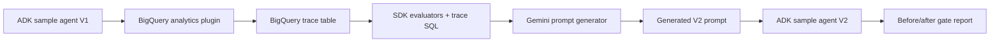

# Live Verification

Last verified: 2026-06-09, America/Los_Angeles

Run id: `run_20260609_171547`

Command:

```bash
PYTHON_BIN=/path/to/python3.10+ ./run_e2e_demo.sh
```

Raw local artifacts were written to:

```text
reports/run_20260609_171547/
```

The raw `reports/` directory remains ignored because it is per-run output.
This file records the live end-to-end result that should be stable enough
to keep with the demo source.

## What Ran



The live run exercised:

- ADK agent execution with Gemini.
- BigQuery Agent Analytics Plugin trace logging.
- BigQuery trace readback from
  `rag-chatbot-485501.self_evolving_agent_demo.agent_events`.
- SDK deterministic evaluator checks for token efficiency, cost, turn count,
  and error rate.
- Runtime generation of a replacement V2 prompt.
- Evolved-agent rerun against the same deterministic sample eval set.
- Before/after comparison gates.

## Generated Change

The generated V2 prompt changed the agent from broad-first behavior to a
narrowest-sufficient-tool policy:

- Player comparison -> `compare_players`.
- Team comparison -> `compare_teams`.
- Named-player scoring/profile/quick-read -> `get_player_stats`.
- Named-team strategy/strengths/profile/late-game offense ->
  `get_team_profile`.
- `lookup_basketball_reference` only for broad, league-wide, or unsupported
  ambiguous questions.

Candidate source: `model`.

It also changed the answer style from a long fixed scouting-report format
to at most four bullets or 120 words.

## Metrics

| Metric | V1 | Generated V2 | Delta |
|---|---:|---:|---:|
| Quality pass rate | 100% | 100% | +0% |
| Avg total tokens | 3640.2 | 1479.8 | -59.4% |
| Avg tool calls | 2.5 | 1.0 | -60.0% |
| Broad lookup calls | 4 | 0 | -4 |
| Tool errors | 0 | 0 | +0 |

## Gates

| Gate | Result |
|---|---:|
| `quality_not_regressed` | PASS |
| `tokens_reduced` | PASS |
| `broad_lookup_reduced` | PASS |
| `tool_errors_clear` | PASS |

Final result: PASS.

## Baseline SDK Signals

The SDK-backed analysis observed the following V1 signals before generating
the V2 prompt:

- Sessions: 4.
- Avg total tokens: 3640.2.
- Avg tool calls: 2.5.
- Broad lookup sessions: 4/4.
- Quality pass rate: 100%.
- Cost evaluator average observed value: 0.0015.

The default one-run cost remains well under `$1`: the run uses four V1
agent sessions, one prompt-generation call, four generated-V2 sessions,
and small BigQuery reads.
